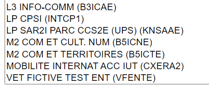
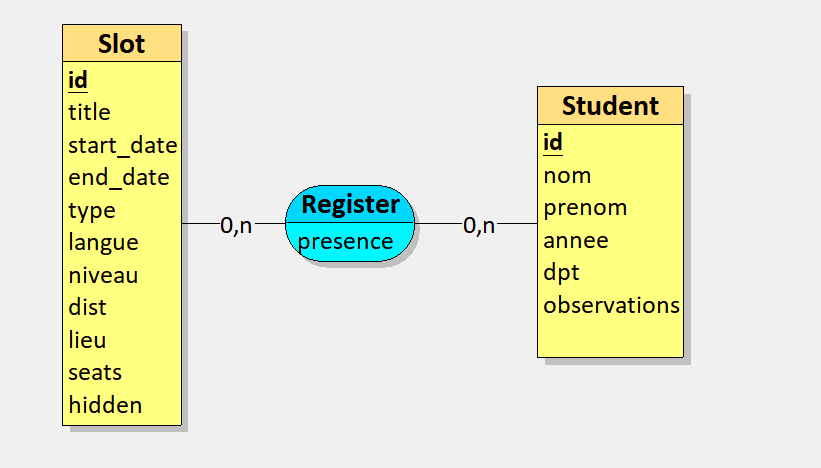

# CrilStatsFusion-Analysis

## Introduction

This project aims to retrieve data from the Cril booking website for analysis and in-depth statistical examination. Once all the data is scraped from the webpage, it is transferred to a database for further analysis.

The project includes the initial setup of an Express server to provide basic interfaces for accessing the data and executing scraping commands. However, this server is essentially a precursor to a potential web interface for the project. Due to the complexity of data manipulation and the infrequent usage (a few times per year), it was deemed unnecessary to invest significant time in developing a full-fledged web interface.

Furthermore, the complexity of data analysis targets users who are not experienced with SQL, necessitating the development of a separate "language" to facilitate desired data cross-referencing.

So, in conclusion the new ultimate goal is to accumulate SQL scripts over time, enabling users to catalog and execute them through a web interface.

## Table of Contents

- [Cril-Stats](#cril-stats)
  - [Introduction](#introduction)
  - [Table of Contents](#table-of-contents)
  - [Web-Scrapping for the Cril Reservations website](#web-scrapping-for-the-cril-reservations-website)
    - [Fetched URLs](#fetched-urls)
      - [Liste des activités / Activities list](#liste-des-activités--activities-list)
      - [Liste des coachings / Coachings list](#liste-des-coachings--coachings-list)
      - [Suivi de présence / Attendance tracking](#suivi-de-présence--attendance-tracking)
    - [Data](#data)
      - [Slots](#slots)
      - [Student Attendance](#student-attendance)
  - [Database](#database)
  - [Server](#server)
  - [Frontend](#frontend)

## Web-Scrapping for the Cril Reservations website

### Fetched URLs

#### Liste des activités / Activities list

La liste des activités est récupérée à partir de l'URL : listeActivite/{int(month + 1)}

#### Liste des coachings / Coachings list

La liste des coachings est récupérée à partir de l'URL : listeCoaching/{int(month + 1)}

#### Suivi de présence / Attendance tracking

Le suivi de présence est récupéré à partir de l'URL : suiviPresence/{base64(DD/MM/YYYY)}

### Data

#### Slots

```json
{
    "hidden": boolean, // If the slot is hidden to the public
    "title": string, // The title of the slot
    "start": string, // The start date of the slot
    "end": string, // The end date of the slot, allows to calculate the duration of the slot
    "id": string, // The id of the slot (unicity key)
    "color": string, // The color of the slot (don't know yet how it's used)
    "type": int, // The type of the slot (1. Activity, 5. Coaching)
    "langue": string, // The language of the slot (AN. English, ES. Spanish)
    "niveau": int, // The level of the slot (0. ll levels 1. Beginner, 2. Intermediate, 3. Advanced)
    "dist": boolean, // If the slot is a remote slot
    "lieu": string, // The location of the slot
    "quota": {
        "seats": int, // The number of seats available
        "insc": int // The number of people registered
    },
    "inscrits": [ // The list of people registered, only the name and first name are stored in the website
        {
            "nom": string, // The name of one person registered
            "prenom": string, // The first name of one person registered
        },
        ...
    ]
}
```

#### Student Attendance

The student attendance is an object scrapped containing the information about the student attendance for a specific slot.
We can later extract the student information, making it unique, and the link between the student and the slot.

```json
{
    "nom": string, // The name of the student
    "prenom": string, // The first name of the student
    "userId": string, // The id of the student
    "annee": string, // The current school year of the student "1A, 2A or 3A"
    "dpt": string, // The department of the student "GCCD"
    "observations": string, // The observations of the student
    "presence": string, // The presence of the student "Validé, Absence justifiée, Absence injustifiée, Fiche Moodle à reprendre, Fiche Moodle à faire"
    "activiteid": string, // The id of the activity
}

```

The `annee` and `dpt` fields are a single field that I split into two fields in the code to make it more readable.
Example: `BUT 1A CHIMIE` is split into `annee: "1", dpt: "CHIMIE"`

List of "specials" departments that needed to be hardcoded in the code:


_Plus: GEA REO Local, that are a "reorientation", as a 1st year student._

## Database

The database is a PostgreSQL database, and the schema looks like this:

```sql
CREATE TABLE Slot(
   id VARCHAR(50) PRIMARY KEY,
   title VARCHAR(255),
   start_date TIMESTAMP WITHOUT TIME ZONE NOT NULL,
   end_date TIMESTAMP WITHOUT TIME ZONE NOT NULL,
   type SMALLINT NOT NULL,
   langue VARCHAR(125),
   niveau SMALLINT,
   dist BOOLEAN,
   lieu VARCHAR(255),
   seats INT,
   hidden BOOLEAN,
);

CREATE TABLE Student(
   id VARCHAR(50) PRIMARY KEY,
   nom VARCHAR(255) NOT NULL,
   prenom VARCHAR(255),
   annee VARCHAR(2),
   dpt VARCHAR(155),
   observations TEXT
);

CREATE TABLE Register(
   id VARCHAR(50),
   id_1 VARCHAR(50),
   presence VARCHAR(155),
   PRIMARY KEY(id, id_1),
   FOREIGN KEY(id) REFERENCES Slot(id),
   FOREIGN KEY(id_1) REFERENCES Student(id)
);
```

Everything is dockerized, and the database is created using the `docker-compose.yml` file.



```bash
# Copy the database schema to the entity folder
typeorm-model-generator -h localhost -d crilstats -u postgres -x postgres -e postgres -o ./entities
```

## Server

The server is a basic Express server that aims to provide a basic interface to interact with the database. It is not the main goal of the project, to make something too difficult, complex or secure while it's meant to be used locally.

## Frontend

The frontend will be a simple React application that will allow users to execute SQL scripts on the database. The scripts will be stored in the database, and the user will be able to execute them through the web interface and then see the results either as a table or a different type of visualization predefined in the script.

## Installation

```bash
# Clone the repository
git clone

# Create the .env file based on the .env.example and then edit it
cp .env.example .env

# Run the docker-compose
docker-compose up -d

# More incoming later
...
```
